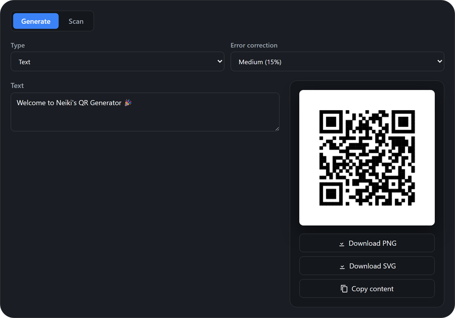

<p align="center">
  
</p>

<h1 align="center">Neiki's QR</h1>

<p align="center">
  
  
  
  
  <br>
  
  
</p>

<p align="center">
  <b>Lightweight, CDN-ready QR Code Generator &amp; Scanner Web Component</b><br>
  <i>Zero dependencies, framework-independent, drop into any page.</i>
</p>

<p align="center">
  
  
  
  
</p>

---

<p align="center">
  
</p>

---

**Live version:** [https://neikiri.dev/qr](https://neikiri.dev/qr)

---

## Overview

Neiki's QR is a Web Component written in plain JavaScript with **zero dependencies** — including its own from-scratch ISO/IEC 18004 QR encoder (versions 1-40, all error correction levels). Drop a single `<neiki-qr>` tag onto a page to get a QR Code **generator** with a dozen-plus ready-made content types (URL, Wi-Fi, contacts, payments, and more), or flip `data-mode` to **scan** and turn the same tag into a live camera / image QR scanner — no framework, bundler, or build step required.

```html
<script src="https://cdn.neikiri.dev/neiki-qr/neiki-qr.min.js"></script>

<neiki-qr id="qr" data-mode="generate" type="url"></neiki-qr>
<script>
  document.getElementById('qr').setFields({ url: 'https://neikiri.dev' });
</script>
```

That snippet renders a scannable QR code for the given URL. Switch `data-mode="scan"` on the same element and it becomes a live QR reader instead.

---

## Why Neiki's QR?

- **One script, no dependencies.** The component ships as a single custom element with its own built-in QR encoder — no third-party QR library is ever loaded.
- **CDN-ready.** Load it from jsDelivr or unpkg and start using `<neiki-qr>` immediately.
- **Generator and scanner in one tag.** The same `<neiki-qr>` element switches its entire UI based on `data-mode="generate"` or `data-mode="scan"`.
- **A dozen-plus QR content types.** Text, URL, Wi-Fi, email, phone, SMS, WhatsApp, contact card (vCard), calendar event, location, SEPA payment, Czech QR payment (SPD), and Bitcoin — each with its own guided form instead of hand-built strings.
- **Live camera scanning.** Uses the browser's native `BarcodeDetector` API for real-time detection from a camera stream or an uploaded image — no extra scanning library shipped.
- **PNG and SVG export.** Download the generated code as a crisp, scalable SVG or a raster PNG.
- **Internationalized out of the box.** English, Czech, German, Spanish, French, Polish, Slovak and Ukrainian translations ship with the component; add or override any language with `addTranslations()`.
- **Accessible by design.** Semantic buttons, labeled form fields, visible focus states, and reduced-motion awareness.
- **Secure by default.** All dynamic content is HTML-escaped before rendering; the component never uploads or transmits scanned/generated data anywhere on its own.

---

## Getting started

The recommended install is the single bundled script from the CDN.

```html
<script src="https://cdn.neikiri.dev/neiki-qr/neiki-qr.min.js"></script>
```

<details>
<summary><b>Other installation options</b> (pinned version, jsDelivr, unpkg, npm, self-hosted)</summary>
<br>

**Pin a specific version (recommended for production)**

```html
<script src="https://cdn.neikiri.dev/neiki-qr/1.0.0/neiki-qr.min.js"></script>
```

**Load CSS and JS separately**

```html
<!-- Latest -->
<link rel="stylesheet" href="https://cdn.neikiri.dev/neiki-qr/neiki-qr.css">
<script src="https://cdn.neikiri.dev/neiki-qr/neiki-qr.js"></script>

<!-- Or pinned -->
<link rel="stylesheet" href="https://cdn.neikiri.dev/neiki-qr/1.0.0/neiki-qr.css">
<script src="https://cdn.neikiri.dev/neiki-qr/1.0.0/neiki-qr.js"></script>
```

**Alternative CDN — jsDelivr**

```html
<script src="https://cdn.jsdelivr.net/npm/neiki-qr@latest/dist/neiki-qr.min.js"></script>
<!-- Pinned -->
<script src="https://cdn.jsdelivr.net/npm/neiki-qr@1.0.0/dist/neiki-qr.min.js"></script>
```

**Alternative CDN — unpkg**

```html
<script src="https://unpkg.com/neiki-qr@1.0.0/dist/neiki-qr.min.js"></script>
```

**Package manager**

```bash
npm install neiki-qr
# or
yarn add neiki-qr
# or
pnpm add neiki-qr
```

**Self-hosted**

```html
<script src="path/to/dist/neiki-qr.min.js"></script>
```

The built `dist/neiki-qr.min.js` bundles its CSS inline — one file is all you need, no separate stylesheet to keep track of. `dist/neiki-qr.css` and `.min.css` are also published for reference (e.g. to preview the default styles or diff a customization), but the component never fetches them at runtime.

</details>

---

## Basic usage

```html
<neiki-qr
  id="qr"
  data-mode="generate"
  type="url"
  ecc="M"
  size="240"
  theme="auto"
  lang="en"
></neiki-qr>

<script>
  var qr = document.getElementById('qr');
  qr.setFields({ url: 'https://neikiri.dev' });
</script>
```

Switch to scanner mode with the same tag:

```html
<neiki-qr data-mode="scan"></neiki-qr>
```

---

## QR content types

Each type has its own set of guided form fields; call `setType()` to switch and `setFields()` to populate them (or let the user fill in the on-screen form directly).

| Type | `setType()` id | Fields |
|------|------|--------|
| Text | `text` | `text` |
| URL | `url` | `url` |
| Wi-Fi | `wifi` | `ssid`, `password`, `encryption` (`wpa`\|`wep`\|`nopass`), `hidden` |
| Email | `email` | `to`, `subject`, `body` |
| Phone | `tel` | `number` |
| SMS | `sms` | `number`, `message` |
| WhatsApp | `whatsapp` | `number`, `message` |
| Contact (vCard) | `vcard` | `firstName`, `lastName`, `phone`, `email`, `org`, `title`, `url`, `address` |
| Event | `event` | `eventTitle`, `location`, `start`, `end`, `description` |
| Location | `geo` | `lat`, `lon` |
| SEPA payment (EPC/BCD) | `sepa` | `name`, `iban`, `bic`, `amount`, `currency`, `reference` |
| Czech QR payment (SPD) | `czqr` | `account`, `amount`, `variableSymbol`, `specificSymbol`, `constantSymbol`, `message` |
| Bitcoin | `bitcoin` | `address_btc`, `amount`, `label` |

```javascript
qr.setType('wifi');
qr.setFields({ ssid: 'HomeNet', password: 'secret123', encryption: 'wpa' });
```

---

## JavaScript API

```javascript
var qr = document.querySelector('neiki-qr');

// Mode
qr.setMode('generate' | 'scan');
qr.getMode();

// Generate
qr.setType('url');
qr.getType();
qr.setFields({ url: 'https://neikiri.dev' });
qr.getFields();
qr.getValue();              // the raw string encoded into the QR code
qr.toDataURL('png' | 'jpeg');
qr.download('filename', 'png' | 'svg');

// Scan
qr.startScan();
qr.stopScan();
qr.getHistory();            // array of { text, time }
qr.clearHistory();

// Config
qr.setConfig({ theme: 'dark', ecc: 'H', size: 300, lang: 'cs' });
qr.getConfig();

// i18n
qr.setLang('cs');
qr.addTranslations('en', { toolbar: { copy: 'Copy to clipboard' } });
```

---

## Events

All events bubble and are composed (cross Shadow DOM boundary), with details on `event.detail`.

| Event | Fired when | `detail` | Cancelable |
|-------|------------|----------|:---:|
| `neiki-qr:ready` | The component finished its first render | `{ config }` | |
| `neiki-qr:mode-change` | `data-mode` switches between generate/scan | `{ mode }` | |
| `neiki-qr:change` | The generated value changes (field edit, type/ecc switch) | `{ type, fields, value }` | |
| `neiki-qr:render` | A new QR code matrix has been drawn | `{ version, eccLevel, size }` | |
| `neiki-qr:error` | Data is too long to encode, or a scan/camera error occurs | `{ message }` | |
| `neiki-qr:scan-start` / `neiki-qr:scan-stop` | The camera stream starts/stops | `{}` | |
| `neiki-qr:scan` | A QR code is detected (camera or uploaded image) | `{ text }` | ✅ |

```javascript
qr.addEventListener('neiki-qr:scan', function (event) {
  event.preventDefault(); // suppress the built-in history log
  console.log('scanned:', event.detail.text);
});
```

---

## Attributes

| Attribute | Values | Default | Description |
|-----------|--------|---------|--------------|
| `data-mode` | `generate`, `scan` | `generate` | Whether the component shows the generator or the scanner UI |
| `type` | see [QR content types](#qr-content-types) | `text` | Active QR content type (generate mode) |
| `ecc` | `L`, `M`, `Q`, `H` | `M` | Error correction level |
| `size` | number (px) | `240` | Rendered QR code size |
| `theme` | `light`, `dark`, `auto` | `auto` | Visual theme |
| `lang` | `en`, `cs`, `de`, `es`, `fr`, `pl`, `sk`, `uk` | `en` | Interface language |

---

## CSS variables

All variables use the `--nqr-*` prefix and can be overridden per instance or globally:

```css
neiki-qr {
  --nqr-radius: 12px;
  --nqr-accent: #7c3aed;
  --nqr-bg: #ffffff;
  --nqr-color: #1f2328;
}
```

| Variable | Purpose |
|----------|---------|
| `--nqr-radius` / `--nqr-radius-sm` | Container / inner element border radius |
| `--nqr-gap` | Spacing between toolbar controls |
| `--nqr-font-size` | Base font size |
| `--nqr-transition` | Transition timing |
| `--nqr-shadow` | Preview card box-shadow |
| `--nqr-bg` / `--nqr-bg-subtle` / `--nqr-bg-hover` | Background layers |
| `--nqr-color` / `--nqr-color-muted` | Text colors |
| `--nqr-border` | Border color |
| `--nqr-accent` / `--nqr-accent-contrast` | Accent color and its contrasting text/icon color |
| `--nqr-focus-ring` | Keyboard focus ring color |
| `--nqr-danger` / `--nqr-success` | Status colors |

---

## Internationalization

Eight languages ship built in: English (`en`), Czech (`cs`), German (`de`), Spanish (`es`), French (`fr`), Polish (`pl`), Slovak (`sk`) and Ukrainian (`uk`).

```html
<neiki-qr lang="cs"></neiki-qr>
```

```javascript
qr.setLang('uk');
```

Add a new language, or override strings in an existing one, with `addTranslations()`:

```javascript
qr.addTranslations('it', {
  mode: { generate: 'Genera', scan: 'Scansiona' },
  toolbar: { copy: 'Copia contenuto' }
});
qr.setLang('it');
```

Only the keys you pass are merged in — omitted keys fall back to English.

---

## Accessibility

- Every interactive control (mode switch, form fields, download/copy buttons) is a real `<button>`, `<select>`, `<input>`, or `<label>` — no `div`-as-button anti-patterns.
- Visible `:focus-visible` outlines on every interactive element.
- `prefers-reduced-motion: reduce` disables transitions.
- Colors default to sufficient contrast in both light and dark themes.

---

## Security

- The component renders inside a Shadow DOM, isolating its markup and styles from the host page.
- All dynamic text (form input, scan results, translations) is HTML-escaped before being rendered.
- The QR encoder and camera-frame decoding run entirely client-side; the component makes no network requests of its own and does not transmit generated or scanned data anywhere.
- Camera access uses the standard `getUserMedia` permission prompt; the stream is stopped and released as soon as scanning stops or the component disconnects.

See [SECURITY.md](SECURITY.md) for the full policy and how to report vulnerabilities.

---

## Demo

Open [`demo/index.html`](demo/index.html) in a browser (or serve the repo locally) to see the generator across every content type, live camera scanning, themes, i18n, and the full JavaScript API in action.

---

## Build / minify

```bash
npm run build
```

Runs [`minify.py`](minify.py), which reads `src/neiki-qr.js` and `src/neiki-qr.css` and produces:

```
dist/neiki-qr.js       # CSS embedded inline, unminified
dist/neiki-qr.min.js   # CSS embedded inline, minified (recommended)
dist/neiki-qr.css      # standalone copy, for reference
dist/neiki-qr.min.css  # standalone copy, for reference
```

The CSS is baked directly into both JavaScript bundles at build time — loading either `dist` script is enough on its own, no separate stylesheet request required. JS minification uses [Terser](https://github.com/terser/terser) via `npx` when available, falling back to an unminified copy otherwise.

```bash
npm test
```

Runs `node --check` against the source file as a syntax sanity check.

---

## Browser support

Neiki's QR uses Custom Elements v1, Shadow DOM, and standard DOM APIs, and targets current versions of modern browsers. QR **generation** works everywhere Custom Elements and Canvas are supported. Live camera **scanning** additionally requires the [`BarcodeDetector`](https://developer.mozilla.org/en-US/docs/Web/API/Barcode_Detection_API) API (Chrome, Edge, Opera, Android WebView); browsers without it show a friendly fallback message instead of the camera view.

| Browser | Generate | Scan |
|---------|:---:|:---:|
| Chrome | ✅ | ✅ |
| Edge | ✅ | ✅ |
| Opera | ✅ | ✅ |
| Firefox | ✅ | ⚠️ fallback message |
| Safari | ✅ | ⚠️ fallback message |

> Internet Explorer is not supported.

---

## Contributing

Contributions are welcome. Please review [CONTRIBUTING.md](CONTRIBUTING.md) and the [CODE_OF_CONDUCT.md](CODE_OF_CONDUCT.md) before opening an issue or pull request. Security-related reports should follow [SECURITY.md](SECURITY.md).

The component source lives in `src/` (`neiki-qr.js`, `neiki-qr.css`); the distributable builds are in `dist/`.

---

## License

Released under the **MIT License**. See the [LICENSE](LICENSE) file for details.

---

<p align="center">
  Made with ❤️ for the web community
</p>
